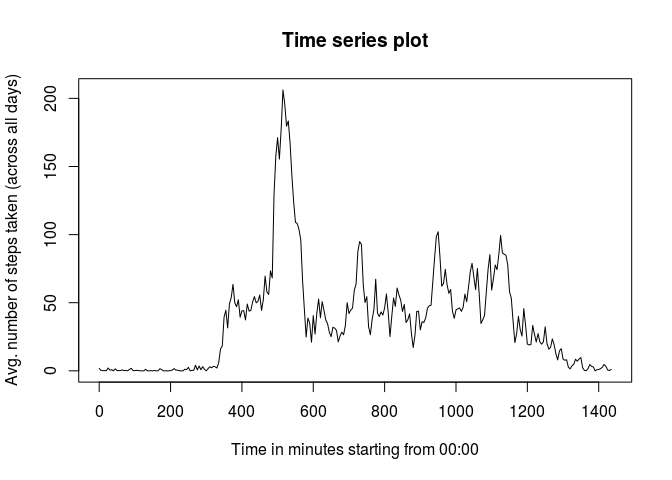
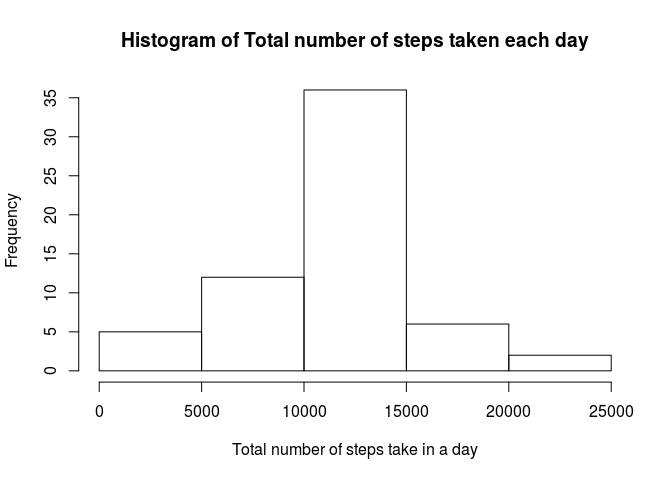
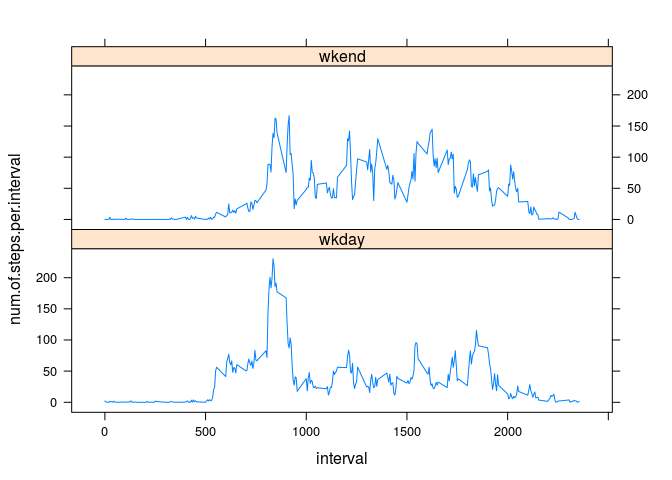

## Loading and preprocessing the data

The processing of data is done where required, not right in the
beginning.


> **Load the data (i.e. read.csv())**
>
> **Process/transform the data (if necessary) into a format suitable for
> your analysis**


```r
library(dplyr)
```


```r
df.original <- read.csv(file="./activity.csv" )

df <- df.original
df$date <- as.POSIXct(as.character(df$date), format="%Y-%m-%d")
```

---

---

## What is mean total number of steps taken per day?

### 1) Make a histogram of the total number of steps taken each day

> **Make a histogram of the total number of steps taken each day**


```r
df <- df[!is.na(df$steps),]#remove NA rows resulting in lesser days (53<--61)
mn0 <- df %>% group_by(date) %>% summarize(num.steps.per.day=sum(steps))

hist(mn0$num.steps.per.day,main="Histogram of Total number of steps taken each day",xlab="Total number of steps take in a day")
```

<!-- -->

### 2)Calculate and report the mean and median total number of steps

> **Calculate and report the mean and median total number of steps
> taken per day**


```r
m <- summary(mn0$num.steps.per.day)
m <- round(mean(mn0$num.steps.per.day, na.rm=TRUE))
n <- median(mn0$num.steps.per.day, na.rm=TRUE)
```
The mean is 1.0766\times 10^{4} and the median is 10765. (for some reason it is
always showing the decimal, skipping it for now!)

---

---

## What is the average daily activity pattern?


### 1) Make a time series plot (i.e. type = "l") of the 5-minute intervals

> **Make a time series plot (i.e. type = "l") of the 5-minute interval
> (x-axis) and the average number of steps taken, averaged across all
> days (y-axis)**

Computing the mean for interval times, averaging across all days 


```r
mn1 <- df %>% group_by(interval) %>%
    summarize(num.of.steps.per.interval=mean(steps))
mn1
```

```
## # A tibble: 288 x 2
##    interval num.of.steps.per.interval
##       <int>                     <dbl>
##  1        0                    1.72  
##  2        5                    0.340 
##  3       10                    0.132 
##  4       15                    0.151 
##  5       20                    0.0755
##  6       25                    2.09  
##  7       30                    0.528 
##  8       35                    0.868 
##  9       40                    0     
## 10       45                    1.47  
## # … with 278 more rows
```

Computing the time from 00:00 in seconds to assist in the time series
plot!


```r
library(stringr)
mn1$interval <- as.character(mn1$interval)
mn1$interval <- str_pad(mn1$interval, width=4, side="left", pad="0")
mn1$interval <- strptime(mn1$interval,"%H%M")
mn1$actualInterval <- mn1$interval-mn1$interval[1]
mn1$actualInterval <- as.numeric(mn1$actualInterval)
```

Plotting the graph

```r
plot(mn1$actualInterval/60, mn1$num.of.steps.per.interval,type="l",
     xlab="Time in minutes starting from 00:00",main="Time series plot",ylab="Avg. number of steps taken (across all days)")
```

<!-- -->

### 2) Which 5-minute interval, on average across all days, has max!

> **Which 5-minute interval, on average across all the days in the dataset, contains the maximum number of steps?**


```r
ind <- which.max(mn1$num.of.steps.per.day)
hrs <- as.numeric(mn1$actualInterval[ind])%/%3600 # to convert to hrs
mins <- as.numeric(mn1$actualInterval[ind])%%3600/60 # to convert 
                                        #remainder to minutes
interval <- paste(hrs,":",mins)
```
The interval  :  (hrs:mins) has max number of steps averaged across all days

---

---

## Imputing missing values

### 1) Calculate and report the total number of missing values 

> **Calculate and report the total number of missing values in the dataset (i.e. the total number of rows with NAs)**


```r
df <- df.original
sum(is.na(df));
```

```
## [1] 2304
```

```r
sum(is.na(df$steps)) #NA only in steps!
```

```
## [1] 2304
```

### 2)  Devise a strategy 

> **Strategy for filling in all of the missing values in the dataset. The
> strategy does not need to be sophisticated. For example, you could use
> the mean/median for that day, or the mean for that 5-minute interval,
> etc.**

We are expected to calculate the total number of steps per day in the
4th step. *The strategy that is chosen is the one where the NA values
are imputed with the mean of the interval (averaged across all days)*

Steps during the same interval across days is expected to be similar
than steps during the entire day. For example: People sleep for 8
hrs in a day and across all the days it is expected that the
steps is same during sleep!

### 3. Create a new dataset with NA imputed

> **Create a new dataset that is equal to the original dataset but
> with the missing data filled in.**


```r
df <- df.original

mn2 <- df %>% group_by(interval) %>% mutate(mean.across.days=mean(steps,na.rm=TRUE))
na.row <- which(is.na(mn2$steps),arr.ind=TRUE)
mn2$steps.imputed <- mn2$steps
mn2$steps.imputed[na.row] <- mn2$mean.across.days[na.row]
mn2
```

```
## # A tibble: 17,568 x 5
## # Groups:   interval [288]
##    steps date       interval mean.across.days steps.imputed
##    <int> <fct>         <int>            <dbl>         <dbl>
##  1    NA 2012-10-01        0           1.72          1.72  
##  2    NA 2012-10-01        5           0.340         0.340 
##  3    NA 2012-10-01       10           0.132         0.132 
##  4    NA 2012-10-01       15           0.151         0.151 
##  5    NA 2012-10-01       20           0.0755        0.0755
##  6    NA 2012-10-01       25           2.09          2.09  
##  7    NA 2012-10-01       30           0.528         0.528 
##  8    NA 2012-10-01       35           0.868         0.868 
##  9    NA 2012-10-01       40           0             0     
## 10    NA 2012-10-01       45           1.47          1.47  
## # … with 17,558 more rows
```


### 4a. Histogram with total number of steps taken each day

> **Make a histogram of the total number of steps taken each day and
> Calculate and report the mean and median total number of steps taken
> per day.**


```r
mn3 <- mn2 %>% group_by(date) %>%
summarize(num.steps.per.day=sum(steps.imputed))

hist(mn3$num.steps.per.day,main="Histogram of Total number of steps taken each day",xlab="Total number of steps take in a day")
```

<!-- -->

### 4b. mean and median


> **Do these values differ from the estimates from the first part
> of the assignment? What is the impact of imputing missing data on the
> estimates of the total daily number of steps?**


```r
m <- mean(mn3$num.steps.per.day)
n <- median(mn3$num.steps.per.day)
```
The mean of the imputed DF is 1.0766189\times 10^{4} and the median is 1.0766189\times 10^{4}.


```r
summary(mn3$num.steps.per.day) # imputed data
```

```
##    Min. 1st Qu.  Median    Mean 3rd Qu.    Max. 
##      41    9819   10766   10766   12811   21194
```

```r
summary(mn0$num.steps.per.day) # Data with NA's removed
```

```
##    Min. 1st Qu.  Median    Mean 3rd Qu.    Max. 
##      41    8841   10765   10766   13294   21194
```

Higher frequency (from 25-->35 days) of total steps (10k to 15k) are
observed. A bit of difference in the 1st and 3rd quartile.  It doesn't
differ much in the median and mean because only 13% of the data is
missing, and the approximation didn't distort the data.

---
---

## Are there differences in activity patterns between weekdays adn
## weekends?

### 1. Create a new variable for "weekday", "weekend"

> **Create a new factor variable in the dataset with two levels --
> "weekday" and "weekend" indicating whether a given date is a weekday
> or weekend day.**


```r
df <- mn2 # inherting the imputation
df$daynum <- as.POSIXlt(as.character(df$date))$wday 
df$daytype <- df$daynum
df$daytype[df$daynum %in% c(0,6)] <- "wkend"
df$daytype[!df$daynum %in% c(0,6)] <- "wkday"
df$daytype <- as.factor(df$daytype)
df[sample(1:nrow(df),size=100),]
```

```
## # A tibble: 100 x 7
## # Groups:   interval [86]
##    steps date       interval mean.across.days steps.imputed daynum daytype
##    <int> <fct>         <int>            <dbl>         <dbl>  <int> <fct>  
##  1     0 2012-11-08     2335             4.70             0      4 wkday  
##  2     0 2012-10-02      410             2.57             0      2 wkday  
##  3     0 2012-11-27      155             0                0      2 wkday  
##  4     0 2012-11-23      935            45.2              0      5 wkday  
##  5     0 2012-10-30     2135            16.3              0      2 wkday  
##  6    60 2012-11-25     1505            36.1             60      0 wkend  
##  7     0 2012-10-02     1940            30.2              0      2 wkday  
##  8     0 2012-10-04      300             0                0      4 wkday  
##  9     0 2012-10-23     1410            43.6              0      2 wkday  
## 10     0 2012-10-12     1050            25.1              0      5 wkday  
## # … with 90 more rows
```

### 2. Make a panel plot!

> **Make a panel plot containing a time series plot (i.e. type = "l")
> of the 5-minute interval (x-axis) and the average number of steps
> taken, averaged across all weekday days or weekend days (y-axis).**


```r
library(lattice)
mn <- df %>% group_by(interval,daytype) %>%
    summarize(num.of.steps.per.interval=mean(
                  steps.imputed))
xyplot(num.of.steps.per.interval~interval|daytype,data=mn,type="l", layout=c(1,2))
```

<!-- -->
