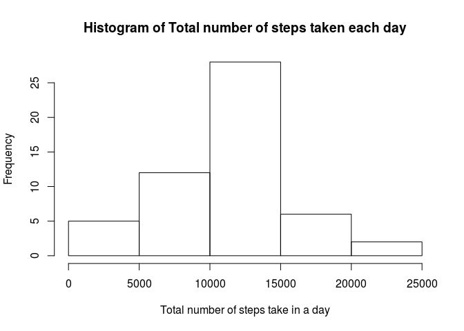

## Loading and preprocessing the data

The processing of data is done where required, not right in the
beginning.


```r
library(dplyr)
```

```
## 
## Attaching package: 'dplyr'
```

```
## The following objects are masked from 'package:stats':
## 
##     filter, lag
```

```
## The following objects are masked from 'package:base':
## 
##     intersect, setdiff, setequal, union
```


```r
df.original <- read.csv(file="./activity.csv" )

df <- df.original
df$date <- as.POSIXct(as.character(df$date), format="%Y-%m-%d")
```
---

## What is mean total number of steps taken per day?

### 1) Make a histogram of the total number of steps taken each day


```r
df <- df[!is.na(df$steps),]#remove NA rows resulting in 8
                                  #lesser days (53<--61)
mn0 <- df %>% group_by(date) %>% summarize(num.steps.per.day=sum(steps))

hist(mn0$num.steps.per.day,main="Histogram of Total number of steps taken each day",xlab="Total number of steps take in a day")
```

<!-- -->
## 2)Calculate and report the mean and median total number of steps taken per day

summary(mn0$num.steps.per.day)


## What is the average daily activity pattern?


## Imputing missing values


## Are there differences in activity patterns between weekdays and weekends?
